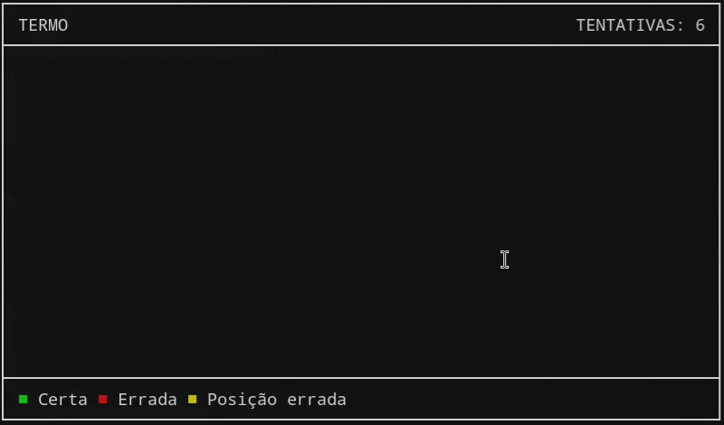

# CTermo


Clone do jogo **Termo** desenvolvido em **C** utilizando a biblioteca **ncurses**.

<div align="center">
  
</div>

## 📦 Compilação

```bash
make
```

## 🛠️ Execução

```bash
./ctermo
```

## 📋 To do

- [x] Interface básica
- [x] Sistema de cores
- [x] Validação simples da palavra
- [ ] Backspace
- [ ] Banco de palavras
- [ ] Palavra aleatória
- [ ] Estatísticas de partidas
- [ ] Melhorar algoritmo de letras repetidas

---

Feito por **Anderson** ([@not2nder](https://github.com/not2nder)).
